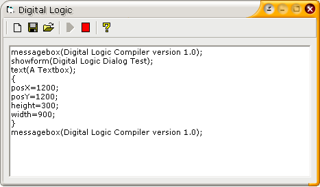



## Digital Logic Compiler

### Description

My first working compiler i wrote other compilers but they were duds i would say and didnt go anywhere i cant believe i uploaded this. I worked hard on it and decided to discontinue it. You can add some cool stuff that compiles it into exe by simply adding the text from the textbox into the main exe file and running it like that it should be hard to code. But this is working i included a little tutorial its in a folder.
 
### More Info
 

             |
---                |---
**Submitted On**   |2002-04-12 16:10:34
**By**             |[John Zappone](https://github.com/Planet-Source-Code/PSCIndex/blob/master/ByAuthor/john-zappone.md)
**Level**          |Advanced
**User Rating**    |4.4 (35 globes from 8 users)
**Compatibility**  |VB 5\.0, VB 6\.0
**Category**       |[Object Oriented Programming \(OOP\)](https://github.com/Planet-Source-Code/PSCIndex/blob/master/ByCategory/object-oriented-programming-oop__1-47.md)
**World**          |[Visual Basic](https://github.com/Planet-Source-Code/PSCIndex/blob/master/ByWorld/visual-basic.md)
**Archive File**   |[Digital\_Lo883015292002\.zip](https://github.com/Planet-Source-Code/john-zappone-digital-logic-compiler__1-35263/archive/master.zip)

